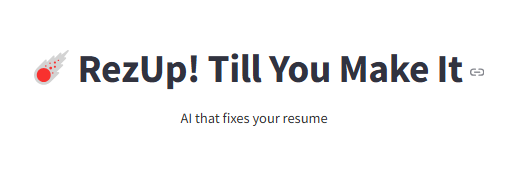

# ☄️ RezUp

<div align="center">
  
</div>

An intelligent resume optimization tool powered by Google's Gemini AI that helps job seekers tailor their resumes to specific job descriptions, improving ATS compatibility and interview chances.

## 🚀 Features

- **AI-Powered Resume Analysis**: Detailed evaluation of resume-to-job alignment
- **ATS Score Optimization**: Improve Applicant Tracking System compatibility
- **Keyword Gap Detection**: Identify missing skills from job descriptions
- **Smart Resume Rewriting**: Enhance with quantified achievements
- **PDF Generation**: Download professionally formatted resumes
- **Progress Tracking**: Visual improvements between versions

## 🖱️How to Use

1. **Upload** your resume PDF
2. **Paste** the target job description  
3. **Select** analysis type:
   - ✅ Resume Evaluation
   - 🔍 Missing Keywords
   - 📊 ATS Score
   - ✨ Skill Improvement
4. **Generate** optimized resume
5. **Download** as PDF

## 🖥️ Tech Stack


## 🧩 Key Components

| Component          | Technology Used     | Purpose                          |
|--------------------|---------------------|----------------------------------|
| PDF Processing     | PyMuPDF             | Extract text from resumes        |
| AI Analysis        | Gemini 1.5 Flash    | Content optimization             |
| Web Interface      | Streamlit           | User interaction                 |
| PDF Generation     | ReportLab           | Create polished resume PDFs      |
| ATS Scoring        | Custom Algorithms   | Compatibility scoring            |

## 🛠️ Installation

### Prerequisites
- Python 3.9+
- Gemini Pro API key ([Get it here](https://makersuite.google.com/app/apikey))

### Setup Instructions

#### 1. Clone repository
```bash
git clone https://github.com/yourusername/rezup.git
cd rezup
```

#### 2. Create virtual environment

###### Windows:
```bash
python -m venv venv
.\venv\Scripts\activate
```
###### MacOS/Linux:
```bash
python3 -m venv venv
source venv/bin/activate
```

#### 3. Install dependencies
```bash
pip install -r requirements.txt
```

#### 4. Configure API key
###### Create .env file with
```bash
GOOGLE_API_KEY="your_api_key_here"
```

## 🖥️ Usage

#### 1. Start the application:
```bash
streamlit run app.py
```
#### 2. Access in browser ([App Link](https://rez-up.streamlit.app/))

## 🤝 Contributing
If you would like to contribute to this project, please follow these steps:

1. Fork the repository.
2. Create a new branch for your feature or bug fix.
3. Make your changes and submit a pull request.


## 📜 License
MIT License

## 📬 Contact
If you have any questions or issues, feel free to reach out to the developer:

**Developer:- Smit Patel**

**Email:- smit23492@gmail.com**


---

© 2025 RezUp. All rights reserved.


